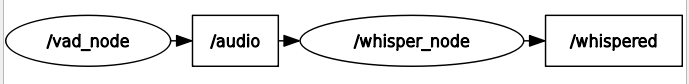
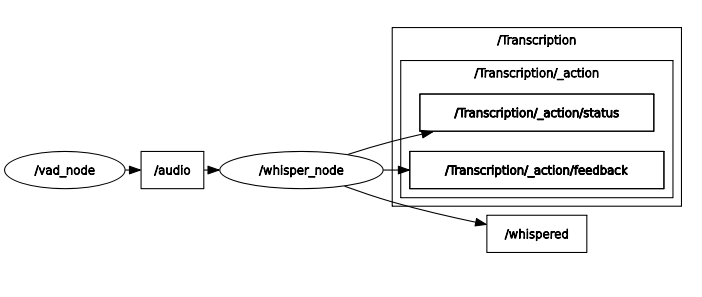

# utbots_stt



- **ROS wrapper for [Silero VAD](https://github.com/snakers4/silero-vad)**
  - Continuously performs Voice Activity Detection (VAD) on your microphone
  - If it contains human voice, waits for a whole sentence to be completed
  - Then publishes "voiced audio" to a ROS topic
  - [Demonstration](https://www.youtube.com/watch?v=CYQ5u8lt4v8)

- **ROS wrapper for [whisper (HF's Transformers)]**
  - Heavyweight implementation of OpenAI's Whisper
  - Performs speech recogition
  - [Demonstration](https://www.youtube.com/watch?v=3EmWbu2jJg0)



## Installation

### Dependencies

```bash

##For whisper:
pip install --upgrade transformers accelerate

##Extra: pip install flash-attn --no-build-isolation ## May not work

```

## Building recomended:

```bash
colcon build --packages-select vad_ros whisper_ros utbots_actions utbots_srvs utbots_msgs \
--allow-overriding utbots_msgs utbots_actions utbots_srvs \
&& source install/setup.bash \
## --symlink-install \ ## if possible

## \
## --symlink-install ## if possible
```

## Running

Run VAD node
```bash
ros2 run vad_ros vad_node
```

Run Whisper node
```bash
ros2 run whisper_ros whisper_node
#or
ros2 run whisper_ros whisper_full_node
```

Run basic STT launch
```bash
#setup stt_launch.py for using whisper or whisper full
ros2 launch  vad_ros stt_launch.py
```

## Parameters
```bash
ros2 param dump /vad_node 
# /vad_node:
#   ros__parameters:
#     use_sim_time: false
#     vad_threshold: 0.5
#     vad_timeout: 5000
#     vad_verbose: false


ros2 param dump /whisper_node #full
# /whisper_node:
#   ros__parameters:
#     enable_synchronous_startup: false
#     timer_period: 0.5
#     use_sim_time: false
#     wait_timeout: 12.0
#     whisper_model: openai/whisper-large-v3-turbo
#     whisper_startup: true
#     whisper_verbose: true
```


## Service
```bash
#To toggle whisper sync transcription on/off
ros2 service call /utbots/voice/enable_transcription std_srvs/srv/SetBool data:\ false\
##


##CURRENTLY NOT WORKING IN SHELL:
ros2 service call /whisper_model utbots_srvs/srv/SetString string:\ \ data:\ \'\'\

```

## Actions
```bash
#To call the Transcription action server (12 s of timeout)
ros2 action send_goal /Transcription utbots_actions/action/Transcription {}\ 
```

#### TODO:
- Evaluate  **Distil-Whisper: Distil-Large-v3.5**
  https://huggingface.co/distil-whisper/distil-large-v3.5
- Requirements for Whisper, VAD and RNNoise instalation

#### TODO (how to do):
- install RNNoise ( make install ! ) (( https://github.com/xiph/rnnoise ))
- install RNNoise_Wrapper (https://github.com/dbklim/RNNoise_Wrapper)
- see vad silero notebook ( https://github.com/snakers4/silero-vad/blob/master/examples/pyaudio-streaming/pyaudio-streaming-examples.ipynb )


###### References:

HF Model Card:
  https://huggingface.co/openai/whisper-large-v3-turbo

Original Paper:
  ```
  @misc{radford2022whisper,
    doi = {10.48550/ARXIV.2212.04356},
    url = {https://arxiv.org/abs/2212.04356},
    author = {Radford, Alec and Kim, Jong Wook and Xu, Tao and Brockman, Greg and McLeavey, Christine and Sutskever, Ilya},
    title = {Robust Speech Recognition via Large-Scale Weak Supervision},
    publisher = {arXiv},
    year = {2022},
    copyright = {arXiv.org perpetual, non-exclusive license}
  }
  ``` 